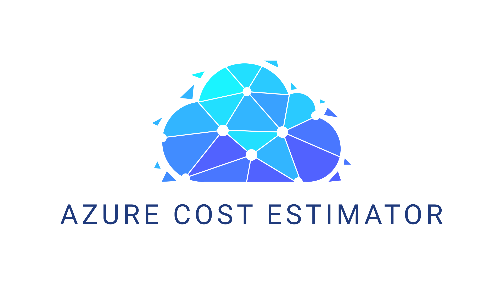

# ACE (Azure Cost Estimator)  

Automated cost estimation of your Azure infrastructure made easy. Works with ARM Templates and Bicep.

## Demo

## Philosophy
As adoption of cloud services progresses, understanding how cloud billing works becomes more and more critical for keeping everything under control. Most of the time initial infrastructure cost estimation is done only during design phase and gets neglected as development progresses. Many development teams don't have enough understanding how to calculate impact of their changes and find difficult to get an immediate feedback whether they're still withing acceptable level of money spent for their services.

Infrastructure-as-Code (IaC) makes things even more difficult - it solves the problem of cloud infrastructure treated as a separate development stream, but doesn't give you control over cost of components under your control.

ACE follows a concept of [_running cost as architecture fitness function_](https://www.thoughtworks.com/radar/techniques/run-cost-as-architecture-fitness-function). You can make it an integral part of your CICD pipeline and quickly gather information of how much you're going to spend.

## Main features
* Supports 47 Azure services (~85 resource types)
* Native support for Bicep & ARM Templates
* Detailed output containing information about cost of your infrastructure and metrics used for calculation
* Seamless integration with ARM Templates and Bicep (with a little help of Bicep CLI)
* Always fresh data thanks to direct calls to Azure Retail API
* Native tool experience - no third-party services / proxies, everything relies on componenets delivered and used by Microsoft
* Multi-option authentication based on `Azure.Identity` package - project automatically uses cached credentials from the running environment (supports Azure CLI / Environment credentials / Managed Identity and more)
* Allows you to validate your deployment before it happens - if the template you used is invalid, an error with detailed information is returned
* Support for both Incremental / Complete deployment modes (see `Usage` section)
* Displaying delta describing difference between your current estimated cost and after changes are applied
* An option to stop CICD process if estimations exceed given limit (see `Usage` section)
* Supports passing parameters along with your template
* Handles extension resources as long as they're correctly configured (i.e. define `scope` parameter)
* Works with both individually defined resources and nested resources
* Supports 17 different currencies
* Allows for generating output as an artifact for further processing
* Ability to consume custom usage patterns for enhancing calculations

## Documentation
Check [wiki](https://github.com/TheCloudTheory/arm-estimator/wiki/About-wiki) for detailed information about installation, usage and available features

## Services support
Services not listed are considered TBD. Below list represents the latest commit available, which isn't always aligned with the most recent release.
Service|Support level|More information
----|----|----
Active Directory B2C|Not Supported|-
Active Directory Domain Services|Not Supported|-
Advanced Data Security|Not Supported|-
Advanced Threat Protection|Not Supported|-
AKS|In development|Supports only VMSS agent pools
APIM|Stable|-
App Configuration|Stable|-
Application Gateway|Stable|-
Application Insights|In development|Supports classic mode, doesn't support Enteprise Nodes and Multi-step Web Test
Analysis Services|Stable|-
ASR|In progress|Doesn't support recovery to customer-owned sites
Automation Account|Stable|Supports Process Automation only
Azure App Service|In development|Supports Azure App Service Plans (without Isolated tiers) and Azure Functions (Consumption / Premium / App Service Plan)
Azure Firewall|Stable|-
Availability Set|Stable|-
Backup|Stable|-
Bastion|Stable|-
Bot Service|Stable|-
Chaos Studio|Stable|-
Cognitive Search|In development|Doesn't support Document Cracking / Semantic Search / Custom Entity Skills Text Records
Confidential Ledger|Stable|Official pricing will be available September 2022
Container Apps|Stable|-
Container Registry|Stable|-
Cosmos DB|In development|Supports only single-region writes with manual throughput provisioning
Data Factory|In Development|Doesn't support IR and SSIS
Event Hub|Stable|-
Event Grid|Stable|-
Health Bot|Stable|-
Key Vault|Stable|Doesn't support Azure Dedicated HSM
Log Analytics|In development|Estimations doesn't include commitment tiers & logs retention
Logic Apps|In development|Doesn't support ISE scale units
Maria DB|Stable|-
Monitor|In development|Alerts estimations doesn't include frequency / metrics count
Network Interface|Stable|-
Network Security Group|Stable|-
PostgreSQL|Stable|Doesn't include `Hyperscale` being part of Cosmos DB
Public IP Address|Stable|-
Public IP Address Prefixes|Stable|-
Redis|Stable|-
Sentinel|In development|Estimations doesn't include commitment tiers
Service Bus|Stable|Doesn't support Hybrid Connections and WCF Relay
SignalR|Stable|-
SQL Database|Stable|-
Storage Account|In development|Supports only StorageV2 (without File Service & Data Lake Storage)
Stream Analytics|Stable|Stream Analytics on Edge requires separate estimation
Time Series|Stable|-
Virtual Machine|In development|Supports Ax, Bx and Dx VM families, doesn't support low-priority / spot VMs
VMSS|Stable|Supports the same VM families as Virtual Machines
Virtual Network|Stable|-
VPN Gateway|Stable|-

## Contributions
Contributions are more than welcome!

## Acknowledgements
* TOC generator - https://ecotrust-canada.github.io/markdown-toc/
* MVP.css - https://github.com/andybrewer/mvp/
