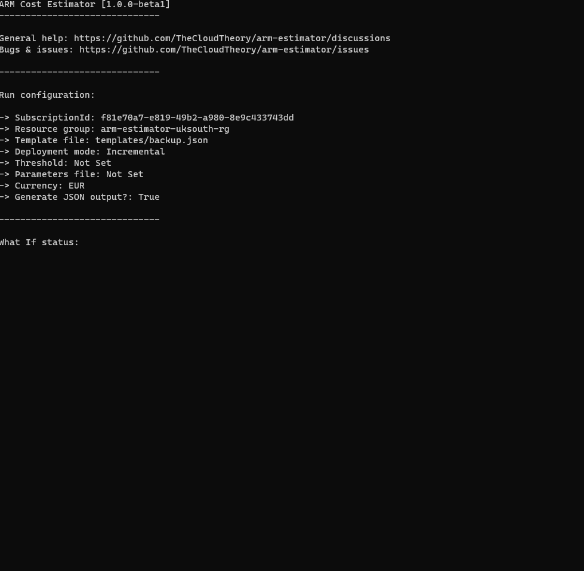

# ACE (Azure Cost Estimator) 
Automated cost estimation of your Azure infrastructure made easy. Works with ARM Templates and Bicep.

## Demo


## Table of contents
* [Philosophy](#philosophy)
* [Main features](#main-features)
* [Installation](#installation)
  + [Docker](#docker)
* [Usage](#usage)
  + [Windows](#windows)
  + [Linux / OSX](#linux--osx)
  + [Docker](#docker-1)
  + [Parameters](#parameters)
  + [Options](#options)
  + [Deployment mode](#deployment-mode)
  + [Threshold](#threshold)
  + [Parameters](#parameters-1)
  + [Currency](#currency)
  + [JSON output](#json-output)
  + [Silent mode](#silent-mode)
  + [Output redirection](#output-redirection)
  + [Disabling detailed metrics](#disabling-detailed-metrics)
  + [JSON output filename](#json-output-filename)
  + [HTML output](#html-output)
  + [Inline parameters](#inline-parameters)
* [Known limitations](#known-limitations)
* [Services support](#services-support)
* [Contributions](#contributions)
* [Acknowledgements](#acknowledgements)

## Philosophy
As adoption of cloud services progresses, understanding how cloud billing works becomes more and more critical for keeping everything under control. Most of the time initial infrastructure cost estimation is done only during design phase and gets neglected as development progresses. Many development teams don't have enough understanding how to calculate impact of their changes and find difficult to get an immediate feedback whether they're still withing acceptable level of money spent for their services.

Infrastructure-as-Code (IaC) makes things even more difficult - it solves the problem of cloud infrastructure treated as a separate development stream, but doesn't give you control over cost of components under your control.

ACE follows a concept of [_running cost as architecture fitness function_](https://www.thoughtworks.com/radar/techniques/run-cost-as-architecture-fitness-function). You can make it an integral part of your CICD pipeline and quickly gather information of how much you're going to spend.

## Main features
* Supports 42 Azure services (~70 resource types)
* Native support for Bicep & ARM Templates
* Detailed output containing information about cost of your infrastructure and metrics used for calculation
* Seamless integration with ARM Templates and Bicep (with a little help of Bicep CLI)
* Always fresh data thanks to direct calls to Azure Retail API
* Native tool experience - no third-party services / proxies, everything relies on componenets delivered and used by Microsoft
* Multi-option authentication based on `Azure.Identity` package - project automatically uses cached credentials from the running environment (supports Azure CLI / Environment credentials / Managed Identity and more)
* Allows you to validate your deployment before it happens - if the template you used is invalid, an error with detailed information is returned
* Support for both Incremental / Complete deployment modes (see `Usage` section)
* Displaying delta describing difference between your current estimated cost and after changes are applied
* An option to stop CICD process if estimations exceed given limit (see `Usage` section)
* Supports passing parameters along with your template
* Handles extension resources as long as they're correctly configured (i.e. define `scope` parameter)
* Works with both individually defined resources and nested resources
* Supports 17 different currencies
* Allows for generating output as an artifact for further processing

## Installation
ACE can be download as ZIP package containing a single executable file. Check releases to find the most recent version download URL.

### Docker
ACE can be also download and used as containerized application. See below for more details how run it as container.

## Usage
You can use the project with both ARM Templates and with Bicep files. In general, ACE doesn't care if you want to use old-school ARM Template or Bicep, however if you face any issues, you can transform Bicep file to ARM Template with help of Bicep CLI:
```
bicep build <your-bicep-file>.bicep
```
This will create an ARM Template based on the Bicep file passed as argument.
> Native Bicep support is available since `1.0.0-beta2` version.

> If you want to use Bicep files and pass them directly to ACE, make sure you've installed Bicep CLI before. This is especially important for build agents, which may have limited capabilities and don't include Bicep by default. In case of any problems, fall back to ARM Templates.

### Windows
```
arm-estimator.exe <template-path>.json|.bicep <subscription-id> <resource-group>
```
### Linux / OSX
```
./arm-estimator <template-path>.json|.bicep <subscription-id> <resource-group>
```
### Docker
Running ACE as Docker container has following benefits:
* you can run it on any host supporting Docker
* you don't need to manually download executable
* there's no need to install Bicep CLI as it's bundled within running container

However, when running a container with ACE, there're additional things to think about. Here's an example of starting ACE as container:
```
docker run -e AZURE_CLIENT_ID=<client-id> -e AZURE_TENANT_ID=<tenant-id> -e AZURE_CLIENT_SECRET=<client-secret> -v ./templates:/app azure-cost-estimator:latest templates/acr.json <subscription-id> arm-estimator-rg
```
Using above command, you can run ACE with default values for options. Once container runs, it'll log all estimation information to stdout. As opposite to running executable, when Docker container is used, you must configure two elements by yourself:
* authentication to Azure
* Docker volume which maps a directory with your template to `/app` directory within container

> Under the hood, ACE uses `Azure.Identity` package for handling authentication. As containers run as isolated hosts, by default they don't have access to e.g. Managed Identity configured for you agent. The easiest way is to leverage `EnvironmentCredentials` as presented above, however if you somehow expose a running container to its host, you may use other ways of authentication.

There're three ways of configuring `EnvironmentCredentials` within a running container:
* setup variables AZURE_CLIENT_ID, AZURE_TENANT_ID and AZURE_CLIENT_SECRET
* setup variables AZURE_CLIENT_ID, AZURE_TENANT_ID and AZURE_CLIENT_CERTIFICATE_PATH
* setup variables AZURE_USERNAME and AZURE_PASSWORD

Which method is used, is transparent to the estimation process.

### Parameters
When using ACE, you must use the following three required parameters:
Name|Default value|Example|Description
---|---|---|---
template-file|N/A|`some_path/some_file.json`|Path to the template file (must be in JSON format)
subscription-id|N/A|`11c43ee8-b9d3-4e51-b73f-bd9dda66e29c`|Identifier (GUID) of your subscription
resource-group|N/A|`mygroup-rg`|Name of the resource group

### Options
Options are non-mandatory parameters, which provide extended functionality for the project. Detailed information how they work can be found below
Name|Default value|Example|Description
---|---|---|---
--mode|`--mode Incremental`|`Complete`|Deployment mode used for calculation. Supports `Incremenetal` and `Complete` deployments
--threshold|`-1`|`--threshold 3000`|Max acceptable estimated cost. Exceeding threshold causes a non-zero exit code to be reported
--parameters|`null`|`--parameters some_path/params.parameters.json`|Path to the parameters file (must be in JSON format)
--currency|`USD`|`--currency EUR`|Currency code to use for estimations
--generateJsonOutput|`false`|`--generateJsonOutput`|Generates JSON file containing estimation result
--silent|`false`|`--silent`|Silences logs so no information is returned to console
--stdout|`false`|`--stdout`|Redirects generated output to stdout instead of file
--disableDetailedMetrics|`false`|`--disableDetailedMetrics`|Disables detailed metrics of estimated resource cost
--jsonOutputFilename|`null`|`--jsonOutputFilename estimationOutput`|Sets a name of JSON output file created when `--generateJsonOutput` is enabled
--generateHtmlOutput|`false`|`--generateHtmlOutput`|Generates HTML file with estimation result
--inline|`null`|`--inline param1=value1 --inline param2=value2`|Passes parameters inline instead of relying on hardcoded values in parameters file

### Deployment mode
##### Available from: 1.0.0-alpha2
When performing resource group level deployment there's an option to select a deployment mode. ACE also supports that option by providing desired value as parameter:
```
arm-estimator <template-path>.json <subscription-id> <resource-group> --mode Incremental|Complete
```

When parameter is not passed, `Incremental` mode is selected. Selecting `Complete` changes the way estimations work - if there're existing resources in a resource group, they will be considered as up for removal. It'll be noted by ARM Cost Estimator and deducted from the final estimation.

### Threshold
##### Available from: 1.0.0-alpha3
With ACE it's possible to stop your CICD process is projected estimation exceeds your assumptions:
```
arm-estimator <template-path>.json <subscription-id> <resource-group> --threshold <int>
```

By using `--threshold` option, you can set an upper limit for infrastructure cost and make sure, that you can re-evaluate changes before they reach cloud environment and affect your billing.
> If estimation exceeds configured threshold, ARM Cost Estimator exits with status code 1. Make sure you check against returned status code and handle that scenario properly. 

Configuring threshold is optional - if you omit it, your CICD process will continue ignoring estimation value.

### Parameters
##### Available from: 1.0.0-alpha4
Very often templates contain parameters, which have different values depending on the selected environment. Sometimes you just need to pass a value, which is generated outside your template. ARM Cost Estimator supports parameters in the same way as you'd normally develop them and pass for deployment:
```
arm-estimator <template-path>.json <subscription-id> <resource-group> --parameters <path-to-your-parameters-file>.json
```
Both ARM Templates and Bicep use parameters defined as JSON files. ACE expects parameters file to be passed without changes, even though Azure What If API expects sending parameters with slightly different schema than parameters file itself.

When using ACE, you parameters file should look like this:
```
{
  "$schema": "https://schema.management.azure.com/schemas/2015-01-01/deploymentParameters.json#",
  "contentVersion": "1.0.0.0",
  "parameters": {
    "dbName": {
      "value": "db"
    },
    "location": {
      "value": "westeurope"
    },
    "sku": {
      "value": "Basic"
    }
  }
}
```

Do not transform it to the schema expected by What If API (which expects value of the `parameters` parameter only).

### Currency
##### Available from: 1.0.0-beta1
It's possible to use one of the supported currencies to display estimation result in appropriate format:
```
arm-estimator <template-path>.json <subscription-id> <resource-group> --currency EUR
```
For now, you can use one of the following currency codes:
Code|Name
---|---
USD|US dollar
AUD|Australian dollar
BRL|Brazilian real
CAD|Canadian dollar
CHF|Swiss franc
CNY|Chinese yuan
DKK|Danish krone
EUR|Euro
GBP|British pound
INR|Indian rupee
JPY|Japanese yen
KRW|Korean won
NOK|Norwegian krone
NZD|New Zealand dollar
RUB|Russian ruble
SEK|Swedish krona
TWD|Taiwan dollar

Support for a given currency depends on capabilities of underlying Azure Retail API. 

### JSON output
##### Available from: 1.0.0-beta1
If you want to use estimation for further automation, it's possible to generate a JSON file containing basic information about estimated resources using `--generateJsonOutput` option:
```
arm-estimator <template-path>.json <subscription-id> <resource-group> --generateJsonOutput
```

If that option is set to `true`, once all data is obtained, a JSON file is created:
```
{
    "TotalCost": 119.3248,
    "Delta": 119.3248,
    "Resources": [
        {
            "Id": "/subscriptions/.../Microsoft.Compute/virtualMachines/ace-vm-01",
            "TotalCost": 29.93,
            "Delta": 29.93
        },
        {
            "Id": "/subscriptions/.../Microsoft.Compute/virtualMachines/ace-vm-02",
            "TotalCost": 63.51,
            "Delta": 63.51
        },
        {
            ...
        }
    ],
    "Currency": "USD"
}
```

Name of the file contains a UTC timestamp - `ace_estimation_yyyyMMddHHssmm.json` - but the file is overwritten if the same timestamp would be used twice.

### Silent mode
##### Available from: 1.0.0-beta2
If you don't want any output to be visible in console, you can use `--silent` option for enabling silent mode:
```
arm-estimator <template-path>.json <subscription-id> <resource-group> --silent
```

Special use case of that option is using it with output redirection:
```
arm-estimator <template-path>.json <subscription-id> <resource-group> --generateJsonOutput --stdout --silent
```

As output redirected to stdout is always considered as non-silent, you can get e.g. estimation JSON without all the noise coming from the tool.

### Output redirection
##### Available from: 1.0.0-beta2
If you don't want an output file to be generated, you can use `--stdout` option to redirect generated output to stdout:
```
arm-estimator <template-path>.json <subscription-id> <resource-group> --generateJsonOutput --stdout 
```

This is especially useful when using estimation output as input for another command or process.

### Disabling detailed metrics
##### Available from: 1.0.0-beta3
By default, ACE reports all aggregated metrics, so you can understand in details how cost was calculated. In scenarios, when you're interested in estimated price only, you can disable detailed metrics for smaller output using `--disableDetailedMetrics` option:
```
arm-estimator <template-path>.json <subscription-id> <resource-group> --disableDetailedMetrics 
```
When this option is enabled, the following output:
```
[Create] acestg28271
   \--- Type: Microsoft.Storage/storageAccounts
   \--- Location: EU West
   \--- Total cost: 0.25 USD
   \--- Delta: +0.25 USD

Aggregated metrics:

-> Standard LRS | Tables | LRS Data Stored | 0.045 for 1 GB/Month
-> Standard LRS | Queues v2 | LRS Data Stored | 0.045 for 1 GB/Month
-> Standard LRS | General Block Blob | LRS Data Stored | 0.024 for 1 GB/Month
...
-> Standard LRS | General Block Blob | LRS List and Create Container Operations | 0.00036 for 10K
-> Standard LRS | General Block Blob | Read Operations - Free | 0 for 10K
-> Standard LRS | General Block Blob | LRS Write Operations - Free | 0 for 10K
```
Will be replaced with:
```
[Create] acestg28271
   \--- Type: Microsoft.Storage/storageAccounts
   \--- Location: EU West
   \--- Total cost: 0.25 USD
   \--- Delta: +0.25 USD
```

### JSON output filename
##### Available from: 1.0.0-beta4
If you want, you can change the default name of JSON output file created when `--generateJsonOutput` option is enabled:
```
arm-estimator <template-path>.json <subscription-id> <resource-group> --generateJsonOutput --jsonOutputFilename my_estimation_file 
```

When `--jsonOutputFilename` is set, ACE will use provided custom name as the filename of JSON output file. Custom file is automatically saved as JSON, however timestamp is not automatically appended to its name.

### HTML output
##### Available from: 1.0.0-beta4
While JSON output may be useful in scenarios when you want to process estimation result, sometimes you just need a prettier version of estimated result for attachment or report. To generate pretty HTML output with estimated cost, you may use `--generateHtmlOutput` option:
```
arm-estimator <template-path>.json <subscription-id> <resource-group> --generateHtmlOutput
```
Once estimation is completed, ACE will generate an HTML file with result data available in the working directory.
> ACE comes with HTML template available for further customization. If you don't like how the result file looks like, you can modify Html/GeneratorTemplate.html file in any way you want. Remember not to remove `### [] ###` placeholders!

### Inline parameters
##### Available from: 1.0.0-beta5
In many scenarios, you want to pass parameters inline instead of providing them via parameters file. Main use case is use of `secureString` type as including secrets in your codebase is considered a bad practice. ACE supports inline parameters by passing them with `--inline` option:
```
arm-estimator <template-path>.json <subscription-id> <resource-group> --inline param1=value1 --inline param2=value2 --inline param3=value3
```
Each inline parameter must be provided as `parameterName=parameterValue` in order to be parsed correctly. Parameters must be named exactly as they're named in your ARM Template / Bicep file, for instance:
```
param location string = resourceGroup().location
param singleLineObject object
param exampleArray array

@secure()
param adminPassword string
param adminLogin string
param minCapacity int

resource dbserver 'Microsoft.Sql/servers@2021-11-01-preview' = {
  name: 'sqlserver'
  location: location
  properties: {
    administratorLogin: adminLogin
    administratorLoginPassword: adminPassword
  }
}

resource dbbasic 'Microsoft.Sql/servers/databases@2021-11-01-preview' = {
  parent: dbserver
  name: 'ace-db'
  location: location
  sku: {
    name: 'Basic'
  }
  properties: {
    minCapacity: minCapacity
  }
}
```
Will be estimated with the following command:
```
arm-estimator <template-path>.bicep <subscription-id> <resource-group> \
--inline adminPassword=verysecretpassword123 \
--inline adminLogin=adminace \
--inline minCapacity=3 \
--inline singleLineObject={"name": "test name", "id": "123-abc", "isCurrent": true, "tier": 1} \
--inline exampleArray=["1", "2", "3"]
```
Avoid passing objects / array as strings as they need to be parsed correctly as JSON.

## Known limitations
ACE is currently in `beta` development phase meaning there're no guarantees for stable interface and some features are still in design or planning phase. The main limitations as for now are:
* You can use the project only with a resource group as deployment scope
* Some services are in TBD state (see below for more information)
* There's no possibility to define custom usage patterns so some metrics (mainly those described as price per second / hour / day) are projected for full month

Those limitations will be removed in the future releases of the project.

## Services support
Services not listed are considered TBD. Below list represents the latest commit available, which isn't always aligned with the most recent release.
Service|Support level|More information
----|----|----
Active Directory B2C|Not Supported|-
Active Directory Domain Services|Not Supported|-
Advanced Data Security|Not Supported|-
Advanced Threat Protection|Not Supported|-
AKS|In development|Estimates work for managed service (both Free / Paid), estimation doesn't include agent pools
APIM|Stable|-
App Configuration|Stable|-
Application Gateway|Stable|-
Application Insights|In development|Supports classic mode, doesn't support Enteprise Nodes and Multi-step Web Test
Analysis Services|Stable|-
ASR|In progress|Doesn't support recovery to customer-owned sites
Automation Account|Stable|Supports Process Automation only
Azure App Service|In development|Supports Azure App Service Plans (without Isolated tiers) and Azure Functions (Consumption / Premium / App Service Plan)
Azure Firewall|Stable|-
Backup|In Progress|Supports SQL Server in Azure VM, Azure VM, Azure Files, SAP HANA on Azure VM. Supports GRS backup replication only
Bastion|Stable|-
Bot Service|Stable|-
Chaos Studio|Stable|-
Cognitive Search|In development|Doesn't support Document Cracking / Semantic Search / Custom Entity Skills Text Records
Confidential Ledger|Stable|Official pricing will be available September 2022
Container Apps|Stable|-
Container Registry|Stable|-
Cosmos DB|In development|Supports only single-region writes with manual throughput provisioning
Event Hub|Stable|-
Event Grid|Stable|-
Health Bot|Stable|-
Key Vault|Stable|Doesn't support Azure Dedicated HSM
Log Analytics|In development|Estimations doesn't include commitment tiers & logs retention
Logic Apps|In development|Doesn't support ISE scale units
Maria DB|Stable|-
Monitor|In development|Alerts estimations doesn't include frequency / metrics count
Network Interface|Stable|-
Network Security Group|Stable|-
PostgreSQL|Stable|Doesn't include `Hyperscale` being part of Cosmos DB
Public IP Address|Stable|-
Public IP Address Prefixes|Stable|-
Redis|In development|Doesn't support Redis Enterprise
Sentinel|In progress|Estimations doesn't include commitment tiers
SignalR|Stable|-
SQL Database|In development|Supports only Databases (DTU model - Basic & Standard)
Storage Account|In development|Supports only StorageV2 (without File Service & Data Lake Storage)
Stream Analytics|Stable|Stream Analytics on Edge requires separate estimation
Time Series|Stable|-
Virtual Machine|In development|Supports A, BS, D, Dv2, Dv3, Dv4 VM families, doesn't support low-priority / spot VMs
Virtual Network|In development|Doesn't support VNET peering
VPN Gateway|Stable|-

## Contributions
Contributions are more than welcome!

## Acknowledgements
* TOC generator - https://ecotrust-canada.github.io/markdown-toc/
* MVP.css - https://github.com/andybrewer/mvp/
