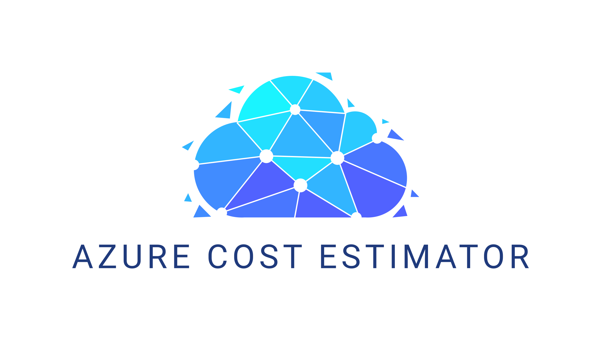

# ACE (Azure Cost Estimator)   

<div align="center">
  

  <b>Automated cost estimation for your Azure infrastructure. Works with ARM Templates, Bicep and Terraform.</b>
</div>

[](https://asciinema.org/a/jqYCjfu18ZbMaGdbsuMtPYuc5)

## ACE + Topaz

ACE's estimation engine is becoming a core part of [Topaz](https://github.com/TheCloudTheory/Topaz) — a single-binary Azure emulator. When used through Topaz, you can estimate the cost of resources already deployed to your local environment without leaving your machine.

ACE remains a fully standalone CLI tool and NuGet library (`TheCloudTheory.AzureCostEstimator.Core`) for teams that want to integrate cost estimation directly into their own pipelines or applications, independent of Topaz.

## What is ACE?

ACE (Azure Cost Estimator) lets you estimate the cost of an Azure deployment *before* it happens. It reads your IaC template — ARM, Bicep, or Terraform — runs a What-If analysis, calls the [Azure Retail Prices API](https://prices.azure.com/api/retail/prices), and gives you a cost breakdown down to the individual resource.

ACE follows the concept of [_running cost as an architecture fitness function_](https://www.thoughtworks.com/radar/techniques/run-cost-as-architecture-fitness-function): make it a gate in your CI/CD pipeline and get immediate feedback on cost impact before any change reaches the cloud.

## Why ACE?

* **Works before deployment** — estimate cost from a template, not a running environment
* **Covers 49 Azure services (~92 resource types)** — ARM, Bicep, and Terraform all supported
* **Always fresh data** — live calls to the Azure Retail Prices API, no stale pricing databases
* **Delta reporting** — shows the cost difference between current and proposed infrastructure
* **CI/CD gate** — optionally fail the pipeline when estimates exceed a configured limit
* **17 currencies** — including USD, EUR, GBP, and more
* **No third-party services** — everything goes through Microsoft APIs; no proxies, no accounts
* **Flexible auth** — `Azure.Identity` picks up CLI, environment, managed identity, and more
* **Usage patterns** — feed custom usage data to refine estimates beyond defaults
* **Multiple deployment scopes** — resource group, subscription, management group, tenant

## Getting started

Check the [wiki](https://github.com/TheCloudTheory/arm-estimator/wiki/About-wiki) for installation, usage, and all available options.

For CI/CD integration, see the dedicated [GitHub Action](https://github.com/TheCloudTheory/azure-cost-estimator-action).

## Using ACE as a library

The core estimation engine is published as a NuGet package:

```
dotnet add package TheCloudTheory.AzureCostEstimator.Core
```

```csharp
var service = new EstimationService();
var result = await service.EstimateAsync(whatIfChanges);
Console.WriteLine($"Total cost: {result.TotalCost} {result.Currency}");
```

## Services support

Services not listed are considered TBD. The table below reflects the latest commit, which may be ahead of the most recent release.

| Service | Support level | Terraform | Notes |
|---|---|---|---|
| AKS | Stable | ✅ | VMSS agent pools only |
| APIM | Stable | ✅ | |
| App Configuration | Stable | ✅ | |
| Application Gateway | Stable | ✅ | |
| Application Insights | Stable | ✅ | Classic mode; no Enterprise Nodes or Multi-step Web Test |
| Analysis Services | Stable | ✅ | |
| ASR | Stable | ✅ | No recovery to customer-owned sites |
| Automation Account | Stable | ✅ | Process Automation only |
| Azure App Service | Stable | ✅ | App Service Plans (no Isolated tiers) + Functions (Consumption / Premium / ASP) |
| Azure Firewall | Stable | ❌ | |
| Availability Set | Stable | ❌ | |
| Backup | Stable | ❌ | |
| Bastion | Stable | ❌ | |
| Bot Service | Stable | ❌ | |
| Chaos Studio | Stable | ❌ | |
| Cognitive Search | In development | ❌ | No Document Cracking / Semantic Search / Custom Entity Skills |
| Confidential Ledger | Stable | ❌ | |
| Container Apps | Stable | ❌ | |
| Container Registry | Stable | ✅ | |
| Cosmos DB | In development | ❌ | Single-region writes with manual throughput only |
| Data Factory | In development | ❌ | No IR or SSIS |
| Event Hub | Stable | ❌ | |
| Event Grid | Stable | ❌ | |
| Health Bot | Stable | ❌ | |
| Key Vault | Stable | ❌ | No Azure Dedicated HSM |
| Log Analytics | In development | ❌ | No commitment tiers or log retention |
| Logic Apps | In development | ❌ | No ISE scale units |
| Maria DB | Stable | ❌ | |
| Monitor | In development | ❌ | No alert frequency or metrics count |
| Network Interface | Stable | ❌ | |
| Network Security Group | Stable | ❌ | |
| PostgreSQL | Stable | ❌ | No Hyperscale (Cosmos DB) |
| Public IP Address | Stable | ❌ | |
| Public IP Address Prefixes | Stable | ❌ | |
| Redis | Stable | ❌ | |
| Sentinel | In development | ❌ | No commitment tiers |
| Service Bus | Stable | ❌ | No Hybrid Connections or WCF Relay |
| SignalR | Stable | ❌ | |
| SQL Database | Stable | ❌ | |
| SQL Server Elastic Pools | Stable | ❌ | |
| Static Web App | Stable | ❌ | |
| Storage Account | In development | ❌ | StorageV2 only (no File Service or Data Lake Storage) |
| Stream Analytics | Stable | ❌ | Edge requires separate estimation |
| Time Series | Stable | ❌ | |
| Virtual Machine | Stable | ❌ | Ax, Bx, and Dx families |
| VMSS | Stable | ❌ | Same VM families as Virtual Machines |
| Virtual Network | Stable | ✅ | |
| VPN Gateway | Stable | ❌ | |

## Contributions
Contributions are more than welcome!

## Acknowledgements
* TOC generator - https://ecotrust-canada.github.io/markdown-toc/
* MVP.css - https://github.com/andybrewer/mvp/
